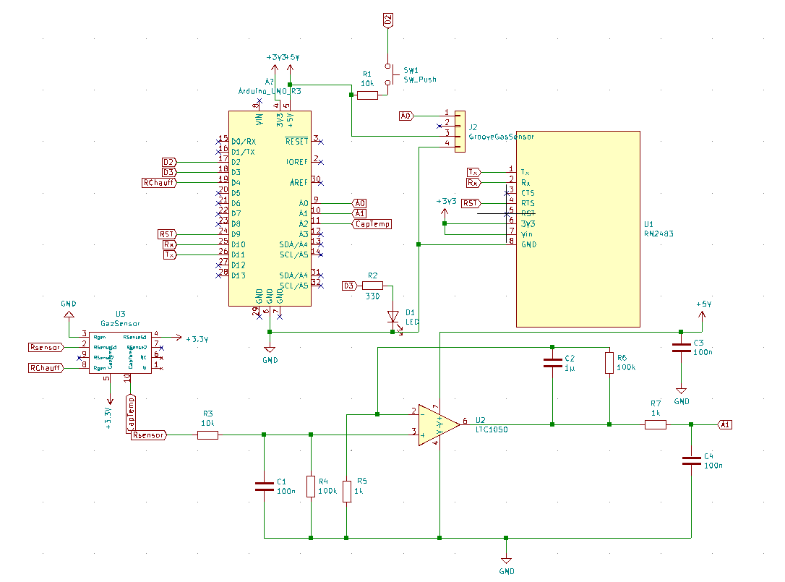
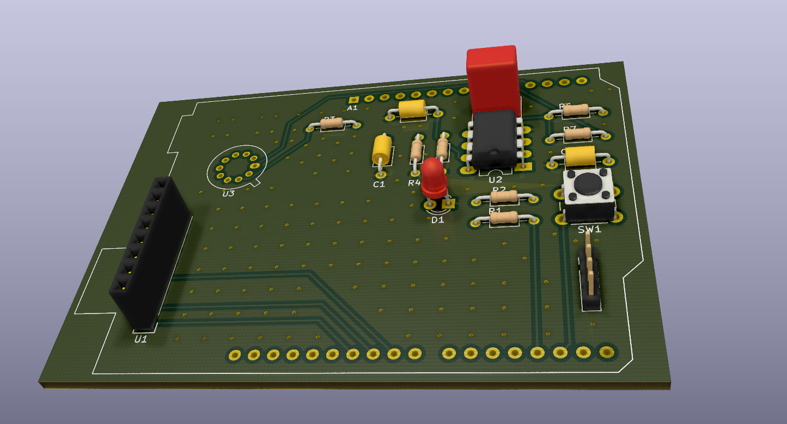
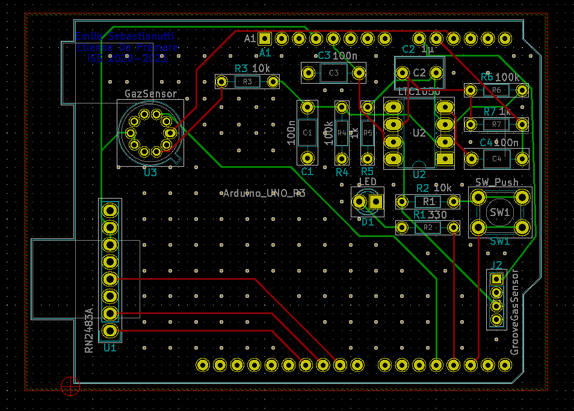
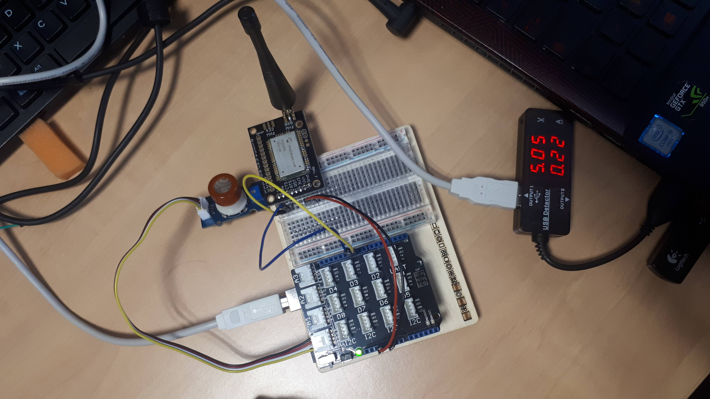
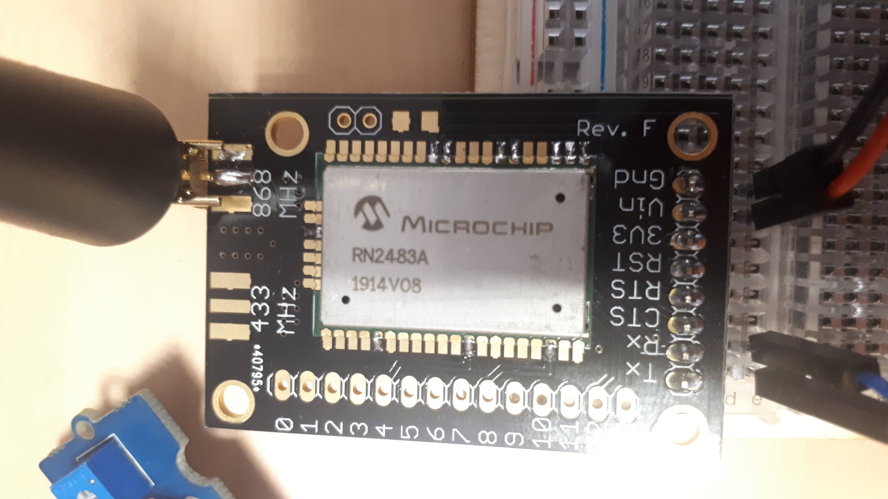

# 2020_DEPREMARE_SEBASTIANUTTI
## MOSH - Smart Sensor

Au cours de projet MOSH, nous avons réalisé de A à Z un capteur intelligent. Ce repository à pour but de partager les différentes étapes de la réalisation de ce sensor.
Il contient : 
- La datasheet du capteur réalisé
- Le schéma LtSpice de validation du circuit de traitement du capteur
- Les schémas électronique et du PCB réalisé avec KiCad
- Le code arduino pour envoyer les données sur TTN
- Un flow Node Red pour recevoir ces données

Le capteur à été réalisé en salle blanche puis caractérisé pour en produire la datasheet. Dans un second temps nous avons réalisé un schéma électronique afin de mesurer le gaz capté par le capteur en suivant la datasheet. Ce schéma se trouve dans le dossier ltspice. Il a ensuite été mis en application sur KiCad

## KiCad - Du prototype à l'industrialisation

### Schéma electronique

Après avoir validé le schéma sur LtSpice, nous l'avons modélisé sur KiCad. Pour cela nous avons du créer les composants inexistants dans les librairies initiales. Voici ci-dessous le schéma global du système :

*Fig.1: Schématique dessinée sur KiCad*

### Shield Arduino Uno

Le shield créé à pour but l'industrialisation du système, il comporte les trou pour y souder notre capteur de gaz, le circuit de traitement du signal schématisé ci-dessus ainsi qu'un bouton pour activer un capteur industriel en cas de défaillance du capteur à nano particules et une LED qui s'allume dans ce cas. un espace est libre sur la carte afin de pouvoir y brancher le module LoRa pour envoyer les données sur TTN.

*Fig.2: Vue de dessus en 3D du PCB*

Pour plus de clarté, voici la vue schématique :

*Fig.3: Schéma du PCB dessiné sur KiCad*

## Utilisation avec microcontrolleur

Le code Arduino fourni permet de récupérer les données du capteur directement depuis la shield KiCad et de l'envoyer sur The Things Network. Attention cependant, nous n'avons pas pu tester la shield en condition réelle, il est donc possible que des problèmes d'intégration surviennent.

*Fig.4: Montage prototype avec mesure de consomation*

Comme présenté sur la figure ci-dessus, nous avons mesuré la consomation du système pour voir où économiser de l'énergie. Nous nous sommes rendu compte que la résistance chauffante du capteur était responsable de la consomation du système et que le reste était négligeable devant celle-ci. Nous proposons donc comme améioration une utilisation non pas encontinue mais par exemple une mesure toutes les minutes (bien sûr l'interval serait à adapter en fonction du cas d'utilisation).

*Fig.5: Puce RN2483 soudée sur une carte untégrable sur la Shield KiCad*

## Utilisation des données

Une fois sur TTN, nous avons utilisé un serveur gratuit Node Red pour visualiser les données et en avons fait un graph. Nous avon voulu intégrer cette vue à una application mobile développée grace au MIT App Inventor mais le serveur Node Red ne permettant l'accès qu'à une socket particulière nous à empêcher de mener le projet à bout.